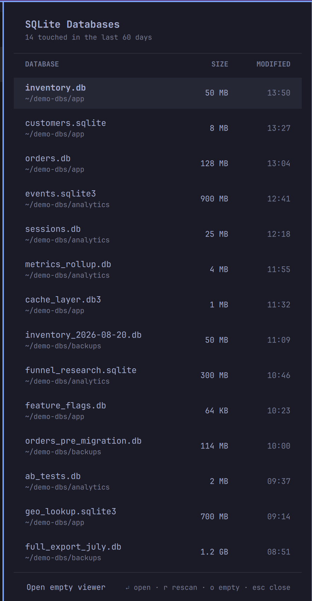

# SQLite Viewer — Omarchy bar widget

A native [Omarchy](https://omarchy.org/) bar panel for your SQLite databases.
Click the database icon and get a themed table of every database file touched in
the last 60 days — name, location, size, and when it changed — sorted newest
first, with your project databases ranked above the app-state ones hiding in
dot-directories. Click a row (or press Enter) and it opens in
[DB Browser for SQLite](https://sqlitebrowser.org/).



## Requirements

- Omarchy 4.x (the widget is built from the shell's own panel components).
- **DB Browser for SQLite**: `omarchy pkg add sqlitebrowser` — the one
  dependency you must install. The widget tells you (via a desktop
  notification) if it's missing.
- `fd` is used for the fast file scan when present (Omarchy installs it by
  default); plain `find` is the automatic fallback. `jq` and `uwsm` are
  Omarchy package dependencies, so they're always there.

## Install

```bash
omarchy plugin add <git-url-of-this-repo> --enable
```

## Use

| Action | Result |
|---|---|
| Left-click bar icon | Open the databases panel |
| Click a row / `Enter` | Open that database in DB Browser |
| `j`/`k` or arrows | Move the selection |
| `r` | Rescan |
| `o` / footer button | Open an empty viewer |
| `Esc` | Close panel |
| Tab | Switch to the neighboring bar panel |
| Right-click bar icon | Skip the panel, launch the viewer directly |

There's also an IPC target for keybindings:
`omarchy-shell sid.sqlite-viewer toggle`.

## What it scans — and what it does with it

Full transparency, because this widget walks your home directory:

- **Scope:** `*.db`, `*.sqlite`, `*.sqlite3`, `*.db3` files under `$HOME`
  modified in the last 60 days, **including hidden directories** (that's how
  it finds things like `~/.grok` or `~/.codex` state databases). Tool caches
  (`node_modules`, `.cache`, `.cargo`, `.rustup`), git internals, browser
  profiles (Chromium, Firefox, Thunderbird), and trash are excluded;
  dot-named files are skipped. Capped at the 14 most recent, with visible
  project paths ranked above databases inside hidden directories.
- **Metadata only:** the scan reads file *names, sizes, and modification
  times* (`fd`/`find` + `stat`). It never opens a database or reads a single
  byte of its contents. Opening contents is DB Browser's job, and only for
  the file you explicitly click.
- **Nothing leaves your machine:** no network access, no telemetry, no
  files written anywhere. The scan output exists only in the shell process's
  memory while the panel is open.
- **No elevated privileges:** nothing runs as root; there is no `sudo` or
  `pkexec` anywhere in this plugin.
- **When it runs:** only on demand — opening the panel or pressing `r`.
  Nothing polls in the background. The scan takes ~30 ms with `fd`.

The exact commands are in [`open-db`](open-db) — it's 77 lines of bash,
please read it before installing (as you should for any shell plugin;
Omarchy plugins run unsandboxed inside your shell process).

The screenshot above shows **staged demo data**, not anyone's real files.

## Remove

```bash
omarchy plugin remove sid.sqlite-viewer
```

This deletes the plugin folder and removes the widget from the bar; nothing
else is touched. `sqlitebrowser` stays until you remove it yourself
(`sudo pacman -R sqlitebrowser`).

## License

MIT — see [LICENSE](LICENSE).
